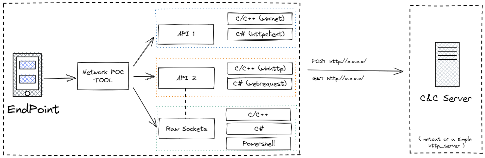

# NetLlix
A project created with an aim to emulate and test exfiltration of data over different network protocols. The emulation is performed w/o the usage of native API's. This will help blue teams write correlation rules to detect any type of C2 communication or data exfiltration.

Currently, this project can help generate HTTP/HTTPS traffic (both GET and POST) using the below metioned progamming/scripting languages:
- CNet/WebClient: Developed in CLang to generate network traffic using the well know WIN32 API's (WININET & WINHTTP) and raw socket programming.
- HashNet/WebClient: A C# binary to generate network traffic using .NET class like HttpClient, WebRequest and raw sockets.
- PowerNet/WebClient: PowerShell scripts to generate network traffic using socket programming.

### Usage:
---
Download the latest ZIP from realease.

#### Running the server:

- With SSl: `python3 HTTP-S-EXFIL.py ssl`

- Without SSL: `python3 HTTP-S-EXFIL.py`

#### Running the client:
- CNet - `CNet.exe <Server-IP-ADDRESS>` - Select any option
- HashNet - `ChashNet.exe <Server-IP-ADDRESS>` - Select any option
- PowerNet - `.\PowerHttp.ps1 -ip <Server-IP-ADDRESS> -port <80/443> -method <GET/POST>`
